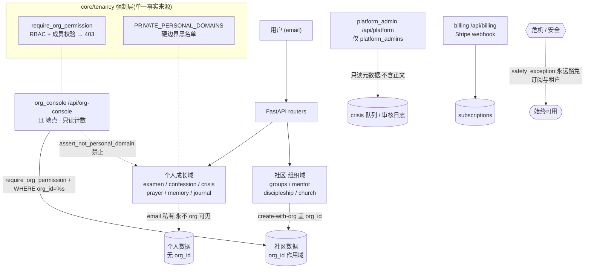

# 属灵星球 · B10–B12 变更总览

本轮在既有 `bible3dsphere`(FastAPI + psycopg2 + 编号 SQL 迁移 + Vite/React)上,落地了 B10/B11/B12 三个批次及其收尾。所有改动沿用仓库既有约定:同步 psycopg2 + 连接池、编号 SQL 迁移(`core/migrations.py` 幂等自动应用)、email 标识用户、router `init_*_router(*, get_db, release_db, get_session_user, to_shanghai_iso)` 注入。

> 沙箱无 Postgres / 无 Vite,故本轮只做了:Python 编译、模块导入、契约/冒烟测试、迁移结构检查、前端括号平衡。**上线前需本地** `python -m core.migrations`(应用 0123–0126)与 `npm run build`。

---

## 总账

| 批次 | 后端 | 迁移 | 前端 |
|---|---|---|---|
| **B10** LLM 导师 + 记忆库 | `ai_tutor`、`spiritual_memory` | 0123、0124 | AITutorChatPage、SpiritualMemoryPage |
| **B11** 可视化 + 审计 | `analytics`/series | —(复用既有表) | FormationChartsPage(纯 SVG) |
| **B12** 真·多租户隔离 | `core/tenancy`、`org_console`、`billing`、`platform_admin`;productization 复用 ROLE_PERMS | 0125、0126 | OrgConsolePage(标签页)、BillingPage、PlatformAdminPage |

`main.py` 现 **101** 个 `app.include_router`。新增迁移 **0123–0126**,版本号全局唯一(此前修复过 0118/0119 重号)。

---

## B10 — LLM 导师对话 + 记忆库

**迁移**:`0123_spiritual_memory.sql`(spiritual_profiles、spiritual_memory_items、memory_consent_rules)、`0124_ai_tutor_threads.sql`(tutor_threads、tutor_messages)。

**`routers/spiritual_memory.py`** `/api/spiritual-memory`(10 端点):画像、记忆条目 CRUD + 搜索、同意规则、给导师的安全接地摘要。危机内容入库自动升 `sensitivity='crisis'`;`exclude_sensitive` 默认开 → 敏感条目不喂 LLM。

**`routers/ai_tutor.py`** `/api/ai-tutor`(多轮线程):每条消息**先过危机安全门**(命中 → 路由 `/api/crisis`,绝不进 LLM);否则用记忆接地 + `llm_provider.generate_text`(真实 provider 已配置时),未配置时回退确定性安全文案。边界:不冒充神/不宣称启示/不给危机医疗指令/不羞辱。

---

## B11 — 可视化 + 安全审计

**`/api/analytics/series`**:按天聚合 10 类操练 → `daily`(热力图)/`weekly`(趋势)/`by_category`;单源失败 `rollback` 不污染事务。

**`FormationChartsPage.jsx`**:**零第三方依赖**的纯 SVG —— GitHub 式操练热力图 + 周趋势面积图 + 分布条;28/84/180 天切换。恩典优先文案(迹象,不是成绩)。

**安全审计**(`SAFETY_AUDIT_B1-13.md`):5 维度,4 项原本合规(不冒充神、禁食健康门、订阅不拦危机、记忆同意门),修复 1 处缺口 —— `journal / personal_notes / daily_soul_question` 三个私密文本入口此前无危机扫描,已附加式加固(响应加 `crisis` 字段,不破坏既有行为)。

---

## B12 — 真·多租户隔离

### 隔离的三条硬不变量
1. **跨组织不可见**:org A 的领袖永远看不到 org B 的社区数据(每个端点 `WHERE org_id=%s` + RBAC)。
2. **个人成长数据永不入组织视图**:省察/认罪/危机/祷告/记忆/灵修日志即使成员属于某 org,组织侧也读不到(牧者可见度**不放开**)。`core/tenancy.PRIVATE_PERSONAL_DOMAINS` + `assert_not_personal_domain()` 是硬边界。
3. **危机/安全永远豁免**:订阅过期 / 组织停用都不影响危机与安全功能(`productization.entitlements/check` 的 `safety_exception`)。

### 隔离架构图

> 静态导出图(无需 mermaid 渲染):[`docs/isolation-architecture.svg`](docs/isolation-architecture.svg)

图例:实线箭头 = 允许的数据流;虚线 `-.->` / `-.-` = 被强制层**禁止**的访问(个人域永不进 org_console)。危机/安全独立于订阅与租户之外,始终可用。

### `core/tenancy.py`(共享强制层,单一事实来源)
`ROLE_PERMS`(productization 改为 import 它)、`require_org_permission()`(非成员/越权 → 403)、`require_membership()`(成员级动作)、`PRIVATE_PERSONAL_DOMAINS` 黑名单。

### 迁移
- `0125_community_org_scope.sql`:给 8 张社区表加可空 `org_id` + 索引(个人成长表**一律不加**)。
- `0126_billing_moderation.sql`:subscriptions 加 Stripe 字段;crisis_moderation_reviews、platform_moderation_log。

### `routers/org_console.py` `/api/org-console`(11 端点,组织侧只读窗口)
my-role、summary、groups、groups/{id}/claim、members、mentor-relationships、mentor-progress、discipleship、group-health、church-trend、activity-trend。每个数据端点 `require_org_permission` + `org_id` 过滤;**只读计数/状态,绝不取 check-in / 会谈 / 步骤 / 反思正文**。`activity-trend` 跨域:教会出勤 vs 小组打卡按周**分域**计数。

### create-with-org(写入归属)
`accountability_group`(需 manage_groups)、`mentor` / `discipleship` / `church_profiles` / `church 签到`(需成员)创建时可盖 `org_id`;church 签到未显式指定时,用户**恰好属于 1 个组织**则自动归属,否则 NULL(保持个人私有)。权限校验置于广义 `except` 之前,403 不被吞。

### `routers/billing.py` `/api/billing`(真 Stripe,与隔离解耦)
checkout(创建 Stripe Checkout 会话)、webhook(验签 → 更新 subscriptions)、status。未配 `STRIPE_SECRET_KEY` 时 checkout 返回 503 并明示"危机/安全永久免费"。env:`STRIPE_SECRET_KEY`、`STRIPE_WEBHOOK_SECRET`、`STRIPE_PRICE_<PLAN大写>`、`PUBLIC_BASE_URL`。

### `routers/platform_admin.py` `/api/platform`(仅 platform_admins)
overview、moderation/crisis-queue(**只暴露风险等级/状态/时间,绝不含 triggering_message/evidence/system_response**)、crisis review、orgs、suspend/reactivate、moderation/log。

### 前端
`OrgConsolePage.jsx` 拆成 **概览/小组/导师/门徒/教会** 标签页(概览含成员名册 + 跨域活跃度双线 sparkline);`BillingPage`、`PlatformAdminPage`。

---

## 测试与 CI 关卡

`.github/workflows/quality.yml` 的 `python-quality` job 顺序:编译 → 既有测试 → Gift&Calling → **契约测试(25)** → **B12 隔离冒烟(40)**。

- **`backend/b12_smoke.py`**(无需 DB,**40 条**不变量):RBAC 矩阵、个人隐私域硬边界、`require_org_permission` 的 403 路径、org_console 各端点强制 + 不取个人正文、platform_admin 全过管理员 + 危机队列不泄正文、危机豁免订阅、计费降级、create-with-org 盖 org_id、进度/趋势端点 org 过滤。
- **契约测试(无 DB,FakeCursor 录 SQL/params)= 25 通过**:`test_org_console_contracts.py`(11,读端点 RBAC+org 过滤+非成员先 403+不取正文)、`test_church_checkin_org_contracts.py`(5,签到按成员资格盖 org_id)、`test_billing_webhook_contracts.py`(5,Stripe 事件→subscriptions 落库 upsert)、`test_platform_admin_contracts.py`(4,suspend/reactivate 改 organizations 状态+写审核日志;非管理员 403 无写入)。
- **`B12_TENANCY_TEST_CHECKLIST.md`**:L1 冒烟 + L2 八组 DB 集成场景(psql 种子 + curl + 期望码)。

---

## 上线前本地三步(沙箱做不了)

1. `cd backend && python -m core.migrations` — 应用 0123–0126。
2. `cd bible3dsphereWeb && npm run build` — 真实 JSX/打包校验。
3. 配 Stripe env + 后台 webhook 指向 `/api/billing/webhook`,用测试卡 `4242 4242 4242 4242` 跑通 checkout→webhook→subscriptions。

## 已知/遗留
- 仓库存在两套并行命名的迁移(`batchX_Y` vs 单技能),本轮未再撞号,建议长期统一编号规则。
- 真实 LLM / Stripe 在沙箱无法端到端验证,均做了优雅降级与确定性兜底。
