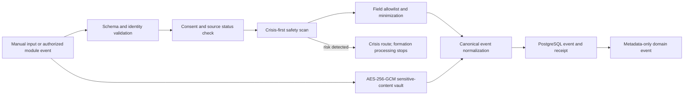

# Formation Twin ingestion flow

All writes are synchronous and atomic in the current FastAPI transaction. Replays return the existing canonical event through a subject-scoped idempotency key. Module ingestion requires a service identity and an active, user-authorized source connection. Rejected values are discarded; receipts store field names, never rejected values.
