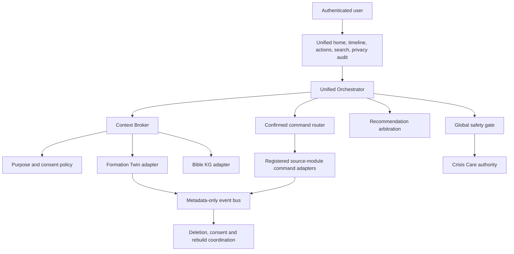

# Spiritual Planet system context map

## Boundary

Spiritual Planet is an orchestration boundary, not a replacement database. The
existing FastAPI application hosts source modules in one process, but logical
module boundaries still apply: only the Context Broker adapter may read a
source module for a cross-module purpose, and only a confirmed command adapter
may write to a target module.

## Integrated logical systems

- Identity OS authenticates the user and resolves personal tenant ownership.
- Worldview, Prayer, Devotion, Holy Habit, Attention, Gift and Calling, Church,
  Mission and Formation modules retain their canonical records.
- Formation Twin owns normalized life events and reviewable emotional and
  formation state, but not raw records from every module.
- Crisis Care is the only authority for crisis cases and safety routing.
- Notification, search and audit receive redacted references and purposes only.

## Current adapter reality

The Batch 9 platform and Formation Twin adapters are registered. Other source
modules exist in the application but do not yet expose the Batch 9 context,
command, deletion and rebuild contracts. Integration health therefore reports
them as `DEGRADED`, not healthy. This is intentional failure-closed behavior.
